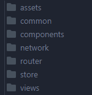
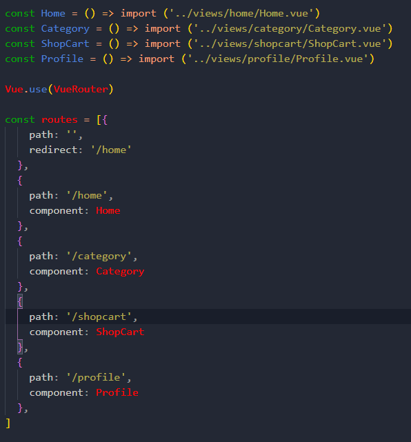
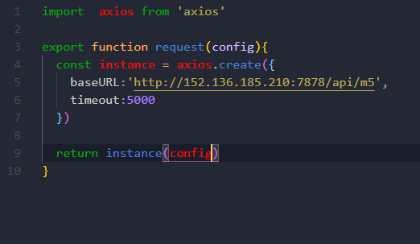
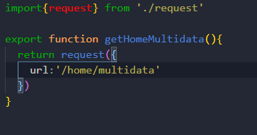
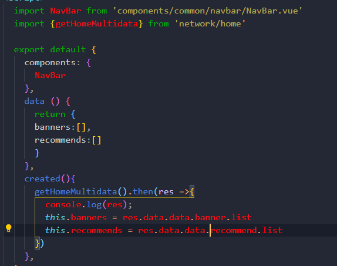

## 目录结构
- assets存放静态资源
  - img图片资源
  - CSS样式
- common存放公共的方法和变量
- components存放公共的组件
  - common存放可复用的组件
  - content存放该项目的组件
- views存放每个页面的组件，例如：home，catagory
- network存放网络连接的资源
- router存放vue路由相关
- store存放vuex相关

---
## 导入重置CSS样式
- 通过`npm i --save normalize.css`重置css默认样式，并复制到assets目录下
- 创建自己的`base.css`文件,并在`App.vue`中导入

## 设置文件的别名
  在根目录下创建一个`vue.config.js`文件，并配置：
  ```javascript
  const path = require('path'); // 引入path模块
function resolve(dir) {
    return path.join(__dirname,dir) //path.join(_dirname)设置绝对路径
}

module.exports = {
    chainWebpack:(config)=>{
        config.resolve.alias
            //第一个参数：别名 第二个参数：路径
            .set('components',resolve('src/components'))
            .set('assets',resolve('src/assets'))
            .set('common',resolve('src/common'))
            .set('views',resolve('src/views'))
    }
};
  ```
---
## 导入之前的Tabbar
tabbar是封装好的组件可以直接导入，MainTabbar是要用户自己传入图片资源，所以放到content目录下，然后再`App.vue`里注册MainTabbar并使用它

然后安装vue-router，并配置相关的路径，然后在`App.vue`中使用`<router-view/>`显示


---
## 首页的配置
### 配置Nav-Bar导航


### 导入之前的网络封装

### 在首页发送网络请求
在network中新建了一个`home.js`创建一个函数来发送网络请求，然后返回一个Promise


调用`getHomeMultidata()`方达来发送网络请求，并创建一个数据保存获取到的轮播图数据



