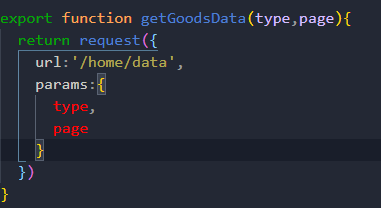
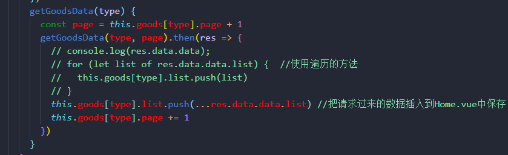
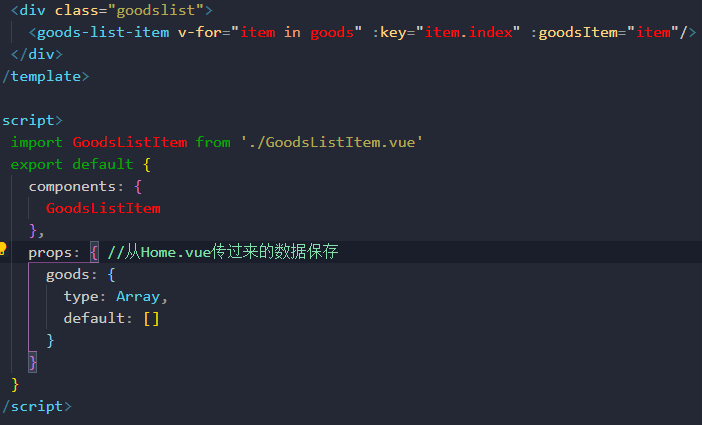

## 请求首页的商品数据
### 封装网络请求
封装网络请求，后端接口需要传入page和type,创建一个params

### 对首页网络请求的方法做一个封装

### 创建GoodsList组件
这是全部商品的组件，每个商品用GoodsList-Item来展示，把请求来的数据（数组）通过`v-for`遍历传给GoodsList-Item用对象来保存每个商品的数据

### 创建GoodsList-Item组件
